# ⚡ Urja - The Voice of Battery Smart

<div align="center">


### 🏆 **Winner: BotGods (4th Hackathon Win)**
*Built for the Battery Smart Hackathon 2026*

</div>

---

**Urja** is a **Real-Time, Bi-Directional Voice AI Agent** designed specifically for the gig-economy drivers of India. It understands **Hinglish (Hindi + English)**, handles complex logistical queries (invoices, station locations), and proactively pitches revenue-saving schemes—all with **sub-second latency**.

---

## 🏗️ System Architecture

We abandoned traditional WebSockets (TCP) for **FastRTC (WebRTC/UDP)** to eliminate "Head-of-Line" blocking and ensure human-like interruptibility.

```mermaid
%%{init: {
  'theme': 'base',
  'themeVariables': {
    'primaryColor': '#1a1a1a',
    'primaryTextColor': '#fff',
    'primaryBorderColor': '#444',
    'lineColor': '#888',
    'secondaryColor': '#2d2d2d',
    'tertiaryColor': '#fff',
    'edgeLabelBackground':'#2d2d2d'
  }
} }%%

flowchart LR
    %% Node Definitions
    User([👤 Driver / User])
    Stream([⚡ FastRTC Stream])
    STT([👂 Deepgram STT])
    Brain([🧠 Groq Llama-3])
    Tools([🧰 Tools & DB])
    TTS([🗣️ Cartesia TTS])

    %% Data Flow Connections
    User -- "Audio (Input)" --> Stream
    Stream -- "Raw Bytes" --> STT
    STT -- "Transcript" --> Brain
    Brain -- "JSON Query" --> Tools
    Tools -- "Data (Invoice/Schemes)" --> Brain
    Brain -- "Response Text" --> TTS
    TTS -- "PCM Stream" --> Stream
    Stream -- "Audio (Output)" --> User

    %% Styling
    classDef proStyle fill:#2d2d2d,stroke:#444,stroke-width:2px,color:#fff,font-weight:bold,font-family:sans-serif;
    class User,Stream,STT,Brain,Tools,TTS proStyle
    
    %% Highlight the "Brain" and "Stream"
    style Brain fill:#d84315,stroke:#ff8a65
    style Stream fill:#1565c0,stroke:#64b5f6
```



---

## 🚀 Key Features

### 1. 🗣️ Native Hinglish Support
Most bots fail at *"Bhaiya, battery ka status kya hai?"*. Urja uses **Deepgram Nova-3** (STT) and **Cartesia Sonic-3** (TTS) to handle code-switching fluently, preserving the Indian accent and cadence.

### 2. ⚡ Ultra-Low Latency (<1s)
By using **Groq (LPU Inference)** and **FastRTC**, we achieved end-to-end latency of **~800ms**.

| Stage | Optimization |
|-------|--------------|
| **STT** | Streaming Audio (No file uploads) |
| **LLM** | Time-to-first-token < 200ms |
| **TTS** | WebSocket streaming (plays before the sentence is finished) |

### 3. 🛠️ Intelligent Tool Calling
Urja isn't just a chatbot; it's an **agent**. It can:

- 📍 **Locate Stations**: *"Mere paas wala station batao."*
- 💵 **Check Finances**: *"Mera invoice clear hai kya?"*
- 📚 **Lazy-Load Knowledge**: Pulls revenue scheme details only when asked.

### 4. 💰 The "Proactive Closer"
Unlike passive bots, Urja acts as a **sales agent**. Upon resolving a technical query, it intelligently checks the driver's sentiment and proposes revenue-saving schemes (e.g., *Monsoon Saver Plan*) to increase retention.

---

## 🛠️ Tech Stack

| Component | Technology | Reasoning |
|-----------|------------|-----------|
| **Orchestrator** | FastRTC | Native Python WebRTC wrapper for barge-in support |
| **Brain (LLM)** | Groq (Llama-3) | Fastest inference on the market for real-time chat |
| **Ears (STT)** | Deepgram Nova-3 | Best-in-class accuracy for Indian languages/accents |
| **Mouth (TTS)** | Cartesia Sonic | Lowest latency generative voice with emotive control |
| **Frontend** | React + Vite | Lightweight dashboard for visual feedback |

---

## 💻 Installation & Setup

### Prerequisites

- ✅ Python 3.10+
- ✅ Node.js & npm
- ✅ API Keys for **Deepgram**, **Groq**, and **Cartesia**

### 1. Backend Setup

```bash
# Clone the repo
git clone https://github.com/BotGods/urja-voicebot.git
cd urja-voicebot

# Install Dependencies
pip install -r backend/requirements.txt

# Setup Environment Variables
cp backend/.env.example backend/.env
# (Edit .env and add your API keys)
```

### 2. Frontend Setup

```bash
cd frontend
npm install
```

### 3. Running the Application

**Terminal 1 (Backend):**
```bash
python -m backend.app.main
# Server starts at http://localhost:8000
```

**Terminal 2 (Frontend):**
```bash
npm run dev
# UI starts at http://localhost:5173
```

---

## 🧪 Testing the Pipeline

We included a dedicated integration test suite to verify latency before deployment.

```bash
# Run the End-to-End Latency Test (CLI)
python backend/tests/test_end_to_end.py
```

This launches a local Gradio interface that measures **STT/LLM/TTS timings** in milliseconds.

---

## 📁 Project Structure

```
urja-voicebot/
├── backend/
│   ├── app/
│   │   ├── core/           # Configuration & prompts
│   │   ├── pipelines/      # Voice streaming logic
│   │   ├── services/       # STT, TTS, LLM services
│   │   └── main.py         # FastAPI entry point
│   ├── tests/              # Integration tests
│   └── requirements.txt    # Python dependencies
├── frontend/
│   ├── src/                # React components
│   └── package.json        # Node dependencies
├── docs/                   # Documentation
└── README.md
```

---

## 👥 The Team (BotGods)

Built with ❤️ by **Team BotGods**

| Name | Role |
|------|------|
| **Abhishek Choudhary** | AI Pipeline & Backend Architecture |
| **Saksham Bassi** | Business Logic & Product Strategy |
| **Ankit Singh Lingwal** | System Integration & Frontend |

---

## 📜 License

This project is licensed under the **MIT License** - see the [LICENSE](LICENSE) file for details.

---

<div align="center">

**Made with ⚡ for Battery Smart Hackathon 2026**

*Powering India's gig economy, one voice at a time.*

</div>
